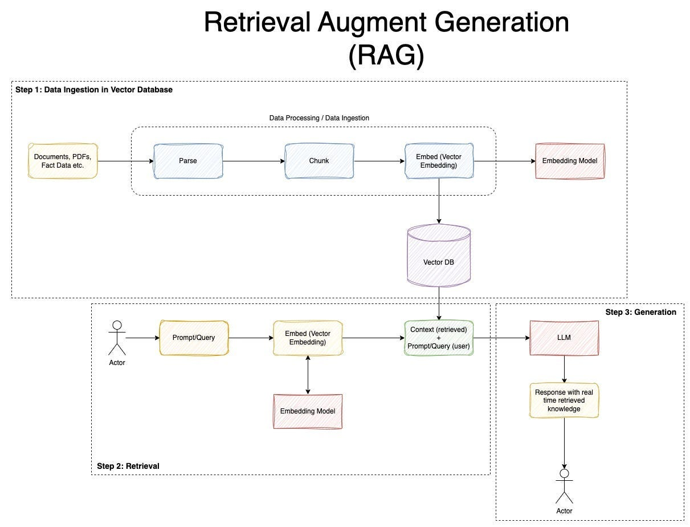

# 🛡️ Insurance Specialist AI System


A sophisticated AI-powered insurance assistant system that combines PostgreSQL database management, vector embeddings with Milvus, and specialized AI agents for insurance domain expertise.

## 🌟 Key Features

- **Multi-Database Integration**: PostgreSQL for structured data + Milvus for vector embeddings
- **Real-time Sync**: Continuous database synchronization between PostgreSQL and Milvus
- **Specialized AI Agents**: Domain-specific insurance experts (Life, Home, Auto)
- **Intelligent Routing**: Smart query routing to appropriate specialists
- **Streamlit UI**: Beautiful, interactive web interface

## 🛠️ Prerequisites

### 📦 Docker Desktop Installation

1. Download and install [Docker Desktop](https://www.docker.com/products/docker-desktop/)  
2. Ensure Docker is running in administrator mode

---

### 📥 Milvus Installation via Docker

```powershell
# Download the installation script
Invoke-WebRequest https://raw.githubusercontent.com/milvus-io/milvus/refs/heads/master/scripts/standalone_embed.bat -OutFile standalone.bat

# Start Milvus container
standalone.bat start
Wait for Milvus starting...
Start successfully.

# Verify Milvus is running (port 19530 should be listening)
docker ps
```

---

## ⚙️ Milvus Management Commands

```powershell
# Stop Milvus
standalone.bat stop
Stop successfully.

# Delete Milvus container and data
standalone.bat delete
Delete Milvus container successfully.
Delete successfully.

# Restart Milvus
standalone.bat start
```


## 🏗️ System Architecture

```mermaid
graph TD
    A[PostgreSQL Database] -->|Stores Insurance Data| B[Sync Process]
    B -->|Generates Embeddings| C[Milvus Vector Database]
    D[Streamlit UI] -->|User Queries| E[Coordinator Agent]
    E -->|Routes to| F[Life Insurance Agent]
    E -->|Routes to| G[Home Insurance Agent]
    E -->|Routes to| H[Auto Insurance Agent]
    C -->|Provides Context| F
    C -->|Provides Context| G
    C -->|Provides Context| H
```
## 📁 File Structure

```
insurance-ai-system/
├── creating_postgres_database.py
├── first_vector_embedding.py
├── syncing_databases.py
├── insurance_agents_main.py
├── .env.example
└── README.md
```
## ⚙️ Installation

### 1. Clone the repository

```bash
git clone https://github.com/yourusername/insurance-ai-system.git
cd insurance-ai-system
```

### 2. Set up environment variables

```bash
cp .env.example .env
```

Edit the `.env` file with your credentials:

```
PG_DB_NAME=insurance_db
PG_USER=postgres
PG_PASSWORD=yourpassword
PG_HOST=localhost
PG_PORT=5432
MILVUS_HOST=localhost
MILVUS_PORT=19530
OPENAI_API_KEY=your_openai_key
GROQ_API_KEY=your_groq_key
```

### 3. Install dependencies

```bash
pip install -r requirements.txt
```

### 4. Initialize the system

```bash
python creating_postgres_database.py
python first_vector_embedding.py
```
## 🚀 Usage

### 1. Start the database sync process

```bash
python syncing_databases.py
```

### 2. Launch the Streamlit app

```bash
streamlit run insurance_agents_main.py
```
## 🧠 AI Agent Specializations

| **Agent Type**     | **Specialization**         | **Example Capabilities**          |
|--------------------|----------------------------|-----------------------------------|
| **Life Insurance** | Mortality risk assessment  | Term vs whole life analysis       |
| **Home Insurance** | Property valuation         | HO-3 vs HO-5 comparisons          |
| **Auto Insurance** | State compliance           | Liability coverage analysis       |

## 🔍 Technical Highlights

- **PostgreSQL Schema Design**: Comprehensive data model with constraints

- **Vector Embeddings**: OpenAI's text-embedding-3-large

- **Real-time Triggers**: PostgreSQL LISTEN/NOTIFY

- **Agent Specialization**: Strict domain boundaries

- **Streamlit UI**: Custom CSS styling
## 🧮 Performance Metrics

- **Embedding Generation**: ~100 records in 2 seconds  
- **Query Response Time**: 1.5–3 seconds average  
- **Database Sync**: Sub-second latency  

---

## 🤝 Contributing

1. Fork the project  
2. Create your feature branch  
3. Commit your changes  
4. Push to the branch  
5. Open a Pull Request  

---

## 📜 License

Distributed under the MIT License.
## 📧 Contact

Project Maintainer - Sam Joe Silvano Putti  

Project Link: [https://github.com/SamJoeSilvano/Insurance-Agentic-AI](https://github.com/SamJoeSilvano/Insurance-Agentic-AI)

---

## 🖼️ Screenshots

  
*System Architecture Overview*

---

## 🔮 Future Enhancements

- Multi-language support  
- Voice interaction  
- PDF policy analysis

